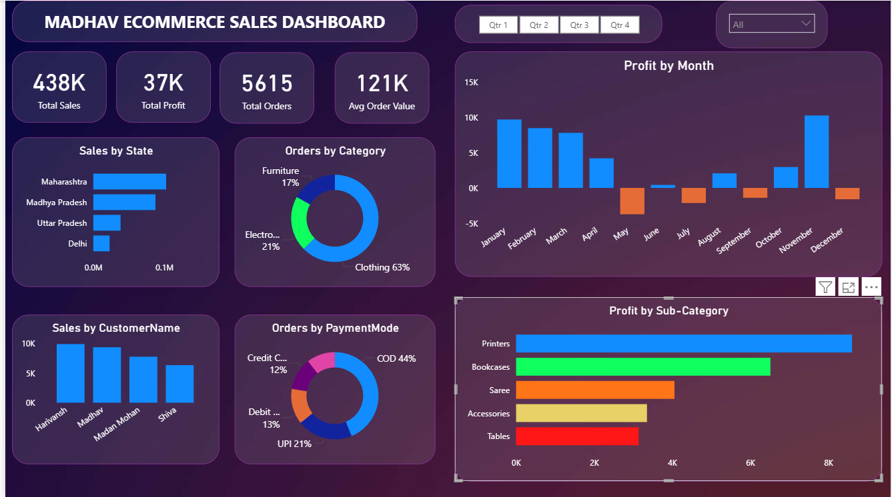
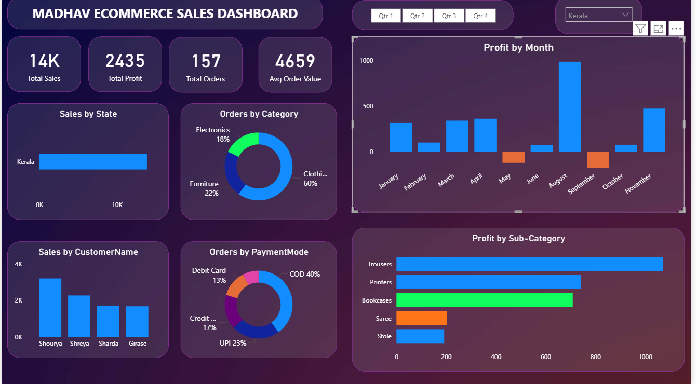
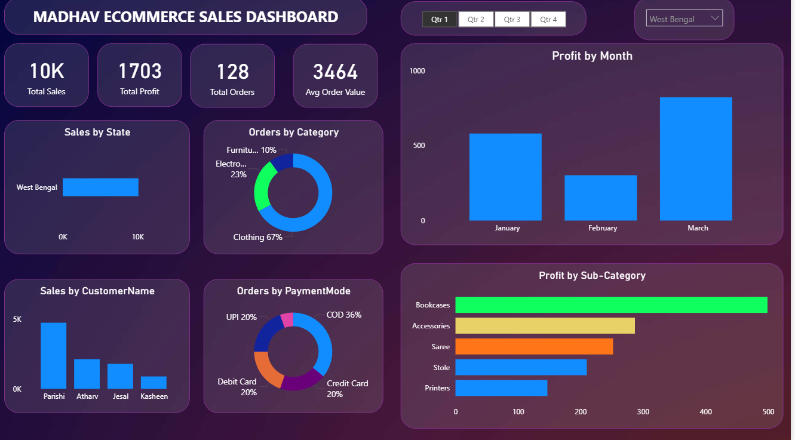

# 📊 Ecommerce Sales Dashboard

## 🔍 Overview

This project presents an interactive Power BI dashboard built to analyze eCommerce sales data of **Madhav Store** across India.
The dashboard helps track performance, identify trends, and support data-driven decision-making.

---

## 🎯 Objective

The owner of *Madhav Store* wanted a dashboard to track and analyze online sales performance across different states, categories, customers, and payment modes.

---

## 🚀 Features

* 📌 KPI Tracking (Total Sales, Total Profit, Total Orders, Avg Order Value)
* 📅 Monthly Profit Analysis (Identify profit & loss trends)
* 🛍 Category & Sub-category Insights
* 🌍 State-wise Sales Analysis
* 👥 Customer-wise Contribution
* 💳 Payment Mode Distribution
* 🎛 Interactive Filters (Quarter & State)

---

## 📸 Dashboard Screenshots

### 🔹 Overview

### 🔹 State-wise Filter View

### 🔹 Quarter-wise Filter View

---

## 📂 Dataset

The dataset used in this project is available here:

🔗 https://drive.google.com/drive/folders/1q_Sd8Ow_FNhIBxL8LFysDvEmFiGl4Whq?usp=sharing

---

## 📈 Key Insights

* Clothing category contributes the highest share (~60%)
* Some months show negative profit → scope for improvement
* COD is the most used payment method (~40%)
* Profit varies significantly across months, indicating seasonal trends

---

## 🛠 Tools & Technologies

* Power BI
* DAX
* Data Visualization

---

## 💡 Conclusion

This dashboard provides a comprehensive view of sales performance and helps identify trends, high-performing products, and areas needing improvement. It enables better business decision-making using data insights.

---

## 👨‍💻 Author

Alok Kumar
